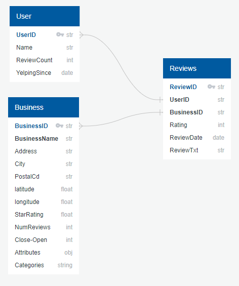
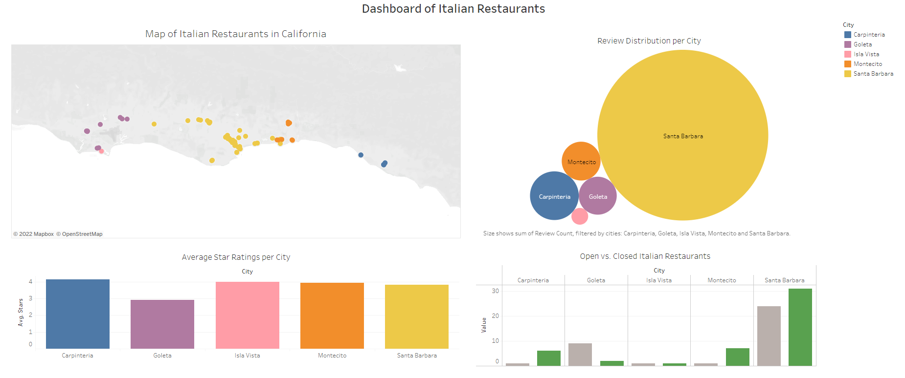

# Final Group Project 

Welcome to the final group project of the Data Analytics Bootcamp. This final project has been designed to showcase the skills learned in the bootcamp.
Each team member has been assigned a role to complete for the project: 

Group members and their respective roles are as follows:
- Circle: Katrin Freitag
- Square: Boakye Twum-Donkor
- Triangle: Matthew Lao
- X: Anand Bajaj

## Topic Selection

As a group, we have decided to anlayze the importance of **customer reviews**for businesses. We decided to focus on this topic, seeing as positive reviews, can be a great way for word-of-mouth advertisement for businesses. They can be a deciding factor as to whether customers will visit a business. Furthermore, from the business perspective, business owners can also improve their business model and increase their customer base by looking at common words that are frequently mentioned in reviews. These frequent words, can additionally be a great source for directed advertisement on social media platforms and in search enginges. 

### Data Source
To help analyze customer reviews, we are using the publically available [Yelp Dataset](https://www.yelp.com/dataset/), as it provides a large amount of information regarding American and Canadian businesses. It provides information regarding users, business reviews, star ratings, and rating counts. The relationship between each dataset has been visualized using and ERD model:

Each business is categorized, making it easier to filter out the required data for our analysis. The dataset has been cleaned, organized and exported into csv files for analysis. Seeing as there are millions of reviews available, we have decided to focus on a subset of **Italian Restaurants in the State of California**:

- [Italian Restaurants in California](resources/yelp_business_dataset_italian_restaurant_clean.csv)
- [Italian Restaurant Reviews](resources/yelp_reviews_Italian_Restaurant_cleanimport.csv)

Using this data, we are trying to gather more information to analzye the following **Business Problem**: 

*How can a business utilize reviews to improve their business model and build a larger customer base?*

### GitHub 
To complete the GitHub requirements for the final project, the [project page](https://github.com/KF59874/final_group_project) includes the following: 
1. Main Branch with all required codes and sources
2. A README.md giving a project overview
3. Separate branches for each group member

### Database
A database has been created using AWS and accomplishes the following:
- The final data structure for Italian Restaurants in California
- Draft [machine learning module](images/Machine_learning.png) is connected to the database

### Exploratory Analysis
For the machine learning portion of this project, we decided to use **Natural Language Processing** to analyze the importance of words in reviews. We looked at the sentiment values of each words, to see if there are frequently used words in positive and negative reviews. 

### Machine Learning Model
The exploratory analysis guided us in establishing a [machine learning model](src/yelp_ml_model) that can predict whether a review is of positive or negative sentiment. This has been completed by looking at the relationship between star ratings and sentiment.

The Machine Learning includes the following:
- Dataset: Yelp Academic Dataset
- Analysis: Machine Learning
- Type: Supervised
- Branch: Classification model

The following models have been explored in the model (including their accuracy levels):
- Logistic Regression Model
- Support Vector Model
- Multinomial Naive Bayes
- Random Forest Classifier Model
- Balanced Random Forest Classifier Model 

### Model Output
Our machine learning model, can accurately predict whether a review is of positive or negative sentiment. Please see below an example of a positive review:
[Model Output - Positive Review](images/pos_model_output)

## Results

### Presentation
A [Google Slide](https://docs.google.com/presentation/d/1H_uyNrVu5GQB9j9eYNoXr4UrZ_MOYtHKkx7B3Pkjguo/edit?usp=sharing) has been created to summarize our findings during this project.

A [dashboard](https://public.tableau.com/app/profile/kf3279/viz/DashboardofItalianRestaurantsinCalifornia/DashboardofItalianRestauransinCalifornia?publish=yes) has  been created to showcase all open and closed Italian restaurants and their relationship to review count and average restaurant star ratings. 

Additionally, a [story board](https://public.tableau.com/app/profile/kf3279/viz/StoryboardofItalianRestaurantsinCalifornia/ItalianRestaurantsinCA?publish=yes) has been published to look into each additional visualization separately in more detail. 
