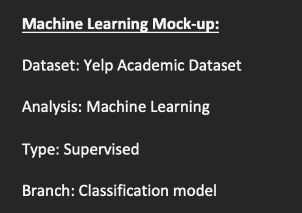

# Final Group Project - First Segment

Welcome to the final group project of the Data Analytics Bootcamp. This final project has been designed to showcase the skills learned in the bootcamp.
This is the first segment of four. Each team member has been assigned a role to complete for the first segment. 

Group members and their respective roles are as follows:
- Circle: Matthew Lao
- Square: Katrin Freitag
- Triangle: Boakye Twum
- X: Anand Bajaj

As a group, we have decided to analyze the customer preference for restaurants in the United States. The following portion provides more detail regarding each section that is requried for the first segment of this project.

## First Segment Requirements

### Presentation/Project Information 
For this project, we have decided to analyze customers preference for American-traditional vs. Non-American-traditional restaurants in the United States. To help analyze customer preferences, we are using the [Yelp Dataset](https://www.yelp.com/dataset/), as it provides a large amount of information regarding American and Canadian businesses. It provides information regarding users, business reviews, star ratings, rating counts, and tips. Each business is also categorized, making it easier to filter out the required data for the analysis. The dataset has been cleaned, organized and exported into csv files for future analysis. It has been reduced to focus on 1000 businesses, users, reviews, and tips:
- [Business Top 1000](Sample%20Data/BusinessTop1000.csv)
- [Reviews Top 1000](Sample%20Data/ReviewTop1000.csv)
- [Users Top 1000](Sample%20Data/UserTop1000.csv)
- [Tip Top 1000](Sample%20Data/TipTop1000.csv)

The relationship between each dataset has been visualized using and ERD model:

Usind this data, we are trying to gather more information to analzye the following **Business Problem**: 
##### *Non-American-Traditional restaurants receive a higher star rating in the Western states of the United States.*

### GitHub 
To complete the GitHub requirements for the first segment, the [project page](https://github.com/KF59874/final_group_project) includes the following: 
1. Main Branch
2. A README.md
3. Separate branch for each group member
4. 4 commits per team member

### Machine Learning Mock-Up Model 
A [provisional machine learning model](Machine_Learning_Mock_up.docx) has been created to help guide the analysis in the following segments. This mdoel stands in for the final machine learning model and accomplishes the following:
- Dataset: Yelp Academic Dataset
- Analysis: Machine Learning
- Type: Supervised
- Branch: Classification model
- Hypothesis: Non-American traditional restaurants receive a higher star rating in the Western States. (edited) 
- Task: Use supervised machine learning to predict whether a new non-American traditional restaurant will receive a higher rating or a lower rating within the Western States of the US.

Using the locational data included in the dataset will help with the visualizations of low vs high rated non-American traditional restaurants on the map. In the following segments, what constitutes a high rating versus a low rating will need to be defined.

The following models are to be explored:
- **Logistic Regression model**
- **Support Vector Model**
- **Random Forest Model**

In the event we run into the problem of class imbalances, then the following models can be explored to arrive at the best model that yields the best results:

- **Random Over Sampler** and **SMOTE algorithms** for over sample
- **Cluster Centroids algorithms** for under sample
- **SMOTEEN** for both over and under sample
- **Balanced Random Forest Classifier** and **Easy Ensemble Classifier** for bias reduction

### Database
A provisional database has been created that stands in for the final database and accomplishes the following:
- [Sample data](Sample%20Data) that mimics the expected final database structure or schema 
- Draft [machine learning module](Machine_learning.png) is connected to the provisional database
